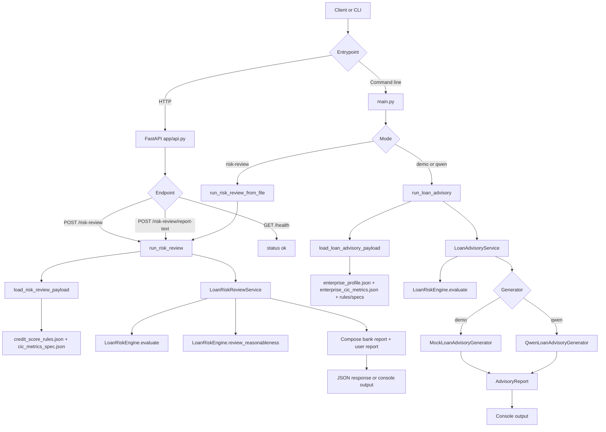

# Vietnamese Loan Advisory Agent

The SOLmate frontend provides a seamless and intuitive user interface designed for both banking professionals and customers, facilitating a transparent and efficient loan advisory process. 

## Key Interfaces

### Banker Workspace
The Banker interface is tailored for efficient loan processing and risk assessment. It allows bankers to:
- Monitor and manage all incoming loan requests.
- Access in-depth loan analysis and financial metrics for each applicant.
- Leverage AI-driven insights to make informed and quick lending decisions.
- Visualize and evaluate credit risk profiles with comprehensive dashboards.


### Customer Workspace
The Customer interface empowers borrowers by giving them clear visibility into their financial standing and loan status. It enables customers to:
- Track their active loan applications and current banking profiles.
- Receive personalized AI suggestions on improving financial health and creditworthiness.


---

## Core logical solutions

This project implements an agent that supports loan assessment for Vietnamese businesses and household businesses. 

## End-to-End Pipeline



## Pipeline by Mode

### 1. `risk-review`

This flow receives a CIC/score payload from the client or from a JSON file, then:

1. Loads rules from `dataset/credit_score_rules.json`
2. Loads metric specs from `dataset/cic_metrics_spec.json`
3. Normalizes the payload into `EnterpriseProfile` and `EnterpriseCICMetrics`
4. Uses `LoanRiskEngine.evaluate(...)` to derive the expected risk assessment
5. Uses `LoanRiskEngine.review_reasonableness(...)` to compare it with the provided `risk_class` and `risk_probability`
6. Produces:
   - `report_text_bank`
   - `report_text_user`
   - `findings`
   - `next_actions`
   - final recommendation

This is the flow currently exposed through the API.

### 2. `demo` / `qwen`

This flow loads sample data by `customer_id` from the `dataset/` directory, then:

1. Loads `enterprise_profile.json`
2. Loads `enterprise_cic_metrics.json`
3. Loads `credit_score_rules.json` and `cic_metrics_spec.json`
4. Runs `LoanRiskEngine.evaluate(...)`
5. Generates an `AdvisoryReport`
   - `demo`: uses `MockLoanAdvisoryGenerator`
   - `qwen`: uses `QwenLoanAdvisoryGenerator` with the default model `Qwen/Qwen3-0.6B`

## Installation

### Run locally

```bash
pip install -r requirements.txt
```

### Run the API

```bash
uvicorn app.api:app --host 0.0.0.0 --port 8000
```

### Run with Docker

```bash
docker compose up --build
```

## Data Requirements

The `dataset/` directory is currently used as the reference data source:

- `enterprise_profile.json`
- `enterprise_cic_metrics.json`
- `credit_score_rules.json`
- `cic_metrics_spec.json`

Specifically:

- `risk-review` only needs `credit_score_rules.json` and `cic_metrics_spec.json`
- `demo` / `qwen` additionally need `enterprise_profile.json` and `enterprise_cic_metrics.json`


## Available API Endpoints

### `GET /health`

Checks service health.

```bash
curl http://localhost:8000/health
```

Response:

```json
{
  "status": "ok"
}
```

### `POST /risk-review`

Reviews whether `risk_class` and `risk_probability` are reasonable, and returns a full report for the bank.

Request body:

```json
{
  "dataset_dir": "dataset",
  "enterprise_profile": {
    "customer_id": "CUST_25552451",
    "merchant_id": "MER_20471946",
    "name": "Ta Gia Phuc",
    "age": 35,
    "industry": "Transportation_Service",
    "business_type": "Sole_Proprietor",
    "years_in_business": 3.79,
    "location": "Hung Yen",
    "created_at": "2022-08-14"
  },
  "enterprise_cic_metrics": {
    "customer_id": "CUST_25552451",
    "credit_score": 359.71,
    "metrics": {
      "Revenue_mean_30d": 500000,
      "Revenue_mean_90d": 800413.56,
      "Txn_frequency": 29.04,
      "regime": "HIGH_RISK",
      "Growth_value": -0.3753,
      "Growth_score": 0.3123,
      "CV_value": 0.5974,
      "CV_score": 0,
      "Spike_ratio": 2.0327,
      "Spike_score": 0.1393,
      "Txn_freq_score": 0.7743,
      "Years_score": 0.2530,
      "Industry_score": 0.3983
    },
    "risk_class": "LOW",
    "risk_probability": 0.5186
  }
}
```

The main response fields include:

- `customer_id`
- `enterprise_overview`
- `provided_risk_class`
- `expected_risk_class`
- `risk_class_is_reasonable`
- `risk_probability_is_reasonable`
- `recommendation`
- `summary`
- `findings`
- `next_actions`
- `report_text`

### `POST /risk-review/report-text`

Same as `POST /risk-review`, but returns only the 2 report text variants:

- `report_text_user`
- `report_text_bank`

Example:

```bash
curl -X POST http://localhost:8000/risk-review/report-text \
  -H "Content-Type: application/json" \
  -d @payload.json
```

Response:

```json
{
  "customer_id": "CUST_25552451",
  "report_text_user": "...",
  "report_text_bank": "..."
}
```