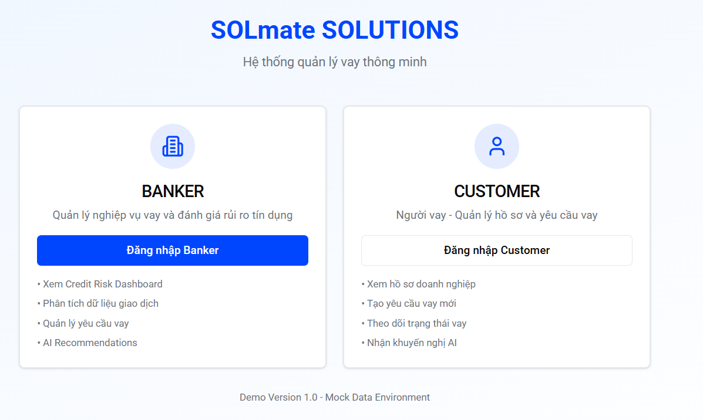
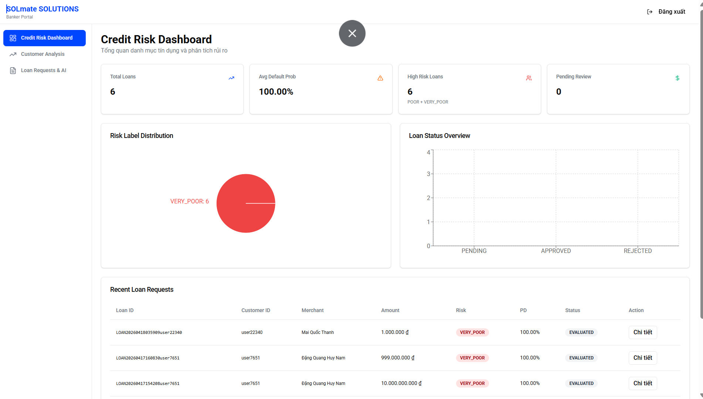
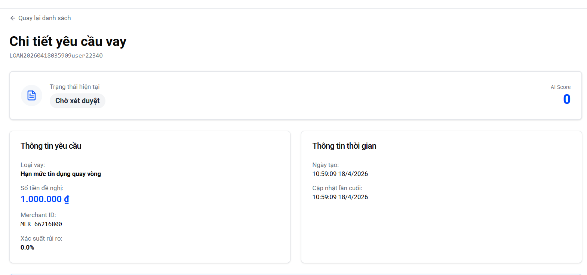
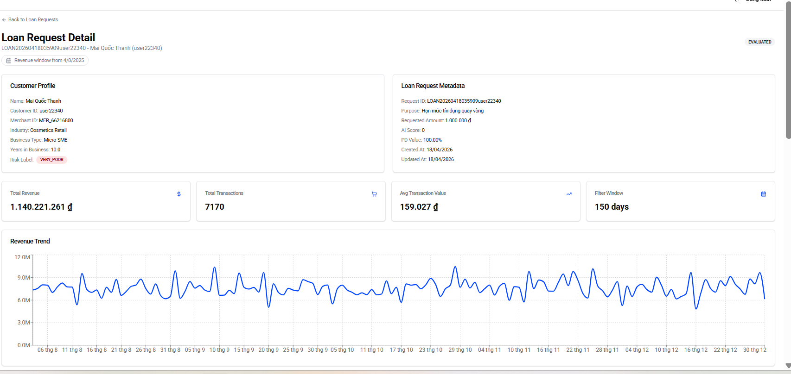
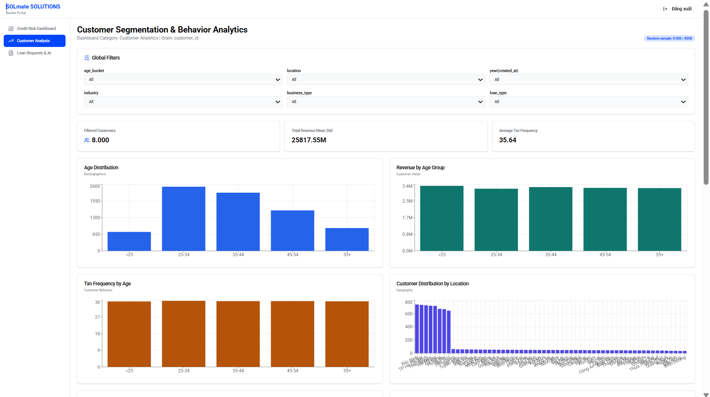
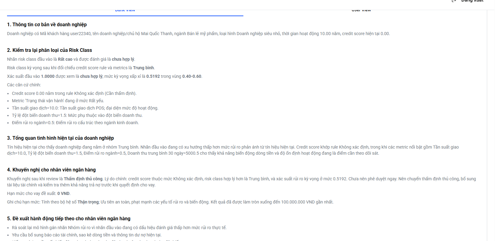
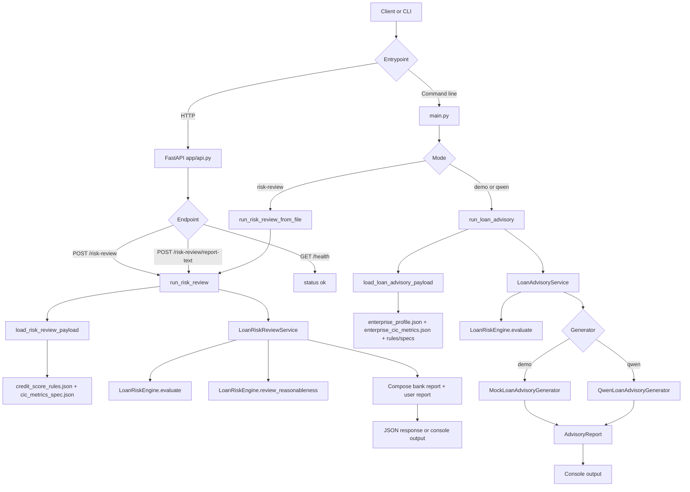

<div align="center">
  
  <h1>VIETNAMESE LOAN ADVISORY SYSTEM</h1>
  <p>
    <b>SOLmate is an AI-powered lending platform for transparent, fast, and explainable loan decisions.</b><br />
    <i>Powered by Golang, Redis, Apache Kafka, PostgreSQL, FastAPI, ONNX Runtime, and React.</i>
  </p>
</div>

> SOLmate combines real-time transaction ingestion, ML-based credit scoring, and explainable AI advisory to help banks evaluate loan requests faster while giving customers clearer, actionable financial guidance.

---

## Key Features

- **AI-Assisted Loan Evaluation:** A Golang scoring service loads ONNX models to estimate risk probability and classify borrower quality in near real time.

- **Dual-Report Advisory Flow:** The Python FastAPI agent returns both customer-friendly and banker-focused report text, helping each side act on the same risk signals with different levels of detail.

- **Event-Driven Data Pipeline:** Transaction events are consumed via Kafka worker services and transformed into merchant/customer feature vectors for downstream lending decisions.

- **Low-Latency Feature Access:** Redis stores and serves merchant-customer features for fast evaluation requests, while Redis Pub/Sub powers real-time status updates.

- **Real-Time Banker Dashboard:** Server-Sent Events stream evaluation completion and risk updates to dashboard clients without polling.

- **Secure API Layer:** JWT-protected endpoints and role-oriented API groups support banker operations, customer loan requests, and internal evaluation workflows.

- **Containerized End-to-End Deployment:** PostgreSQL, Redis, Kafka, API, Worker, and Agent run together with Docker Compose for reproducible local and demo environments.

---

## Technology Stack


- **Backend API:** Golang (Gin) for HTTP APIs, authentication, dashboard data, and lending workflows.
- **Asynchronous Worker:** Golang Kafka consumer for transaction processing and feature generation.
- **AI Scoring Engine:** ONNX Runtime with Go bindings for probability of default and risk label inference.
- **Risk Advisory Agent:** Python FastAPI service for rule-aware narrative reports and loan advisory outputs.
- **Data Stores:** PostgreSQL for durable business data, Redis for feature cache and Pub/Sub streaming channels.
- **Frontend:** React + Vite dashboard experience with modern UI component libraries.
- **API Documentation:** Swagger/OpenAPI generated from backend annotations.
- **Infrastructure:** Docker Compose orchestration with PostgreSQL, Redis, Kafka, Zookeeper, API, Worker, and Agent services.

---

## System Overview

- **Backend:** [backend](backend) contains API and worker executables.
- **AI Agent:** [agent](agent) contains risk review and advisory services.
- **Frontend:** [frontend](frontend) contains dashboard UI source code.
- **Deployment:** [docker-compose.yml](docker-compose.yml) starts the full local stack.

---

## Quick Start

### 1. Run Full Stack (Recommended)

```bash
docker compose up --build
```

### 2. Service Ports (Default by .env)

- API: `localhost:8080`
- Agent: `localhost:8000`
- PostgreSQL: `localhost:${POSTGRES_PORT}`
- Redis: `localhost:${REDIS_PORT}`
- Kafka: `localhost:${KAFKA_PORT}`

### 3. Open API Docs

- Swagger UI: `http://localhost:8080/swagger/index.html`

---

## Core Workflow

1. Merchant/customer transaction data is ingested by worker services through Kafka topics.
2. Features are computed and stored in Redis for low-latency retrieval.
3. Loan evaluation API pulls features, runs ONNX scoring, and classifies risk.
4. Agent service generates explainable advisory reports for banker and customer contexts.
5. Evaluation results are persisted to PostgreSQL and pushed to dashboards through Redis Pub/Sub + SSE.

---

## Project Structure

```text
SOLmate/
|- backend/      # Go API + Go worker + infrastructure + models
|- agent/        # Python FastAPI risk advisory service
|- frontend/     # React + Vite dashboard application
|- migrations/   # Database schema bootstrap scripts
|- image/        # README/UI assets
|- docker-compose.yml
```

---

## Detailed Product Interfaces

### Banker Workspace

The banker experience is focused on fast loan triage and transparent risk decisions:

- Monitor incoming loan requests in one place.
- Inspect score, probability of default, and AI-generated advisory report.
- Track merchant behavior and transaction-based features.

<table style="width: 100%;">
  <tr>
    <td style="width: 50%;"></td>
    <td style="width: 50%;"></td>
  </tr>
  <tr>
    <td style="width: 50%;"></td>
    <td style="width: 50%;"></td>
  </tr>
</table>

### Customer Workspace

The customer experience emphasizes explainability and actionable feedback:

- View loan status and profile-level credit insights.
- Receive AI suggestions to improve credit posture over time.

<table style="width: 100%;">
  <tr>
    <td style="width: 50%;"></td>
    <td style="width: 50%;"></td>
  </tr>
</table>

---

## End-to-End Pipeline (Agent Flow)



---

## Core logical solutions

This project implements an agent that supports loan assessment for Vietnamese businesses and household businesses.

---

## Agent Pipeline by Mode

### 1. risk-review

This flow receives a CIC/score payload from the client or from a JSON file, then:

1. Loads rules from `dataset/credit_score_rules.json`.
2. Loads metric specs from `dataset/cic_metrics_spec.json`.
3. Normalizes the payload into `EnterpriseProfile` and `EnterpriseCICMetrics`.
4. Uses `LoanRiskEngine.evaluate(...)` to derive the expected risk assessment.
5. Uses `LoanRiskEngine.review_reasonableness(...)` to compare it with the provided `risk_class` and `risk_probability`.
6. Produces:
  - `report_text_bank`
  - `report_text_user`
  - `findings`
  - `next_actions`
  - final recommendation

This is the flow currently exposed through the API.

### 2. demo or qwen

This flow loads sample data by `customer_id` from the `dataset/` directory, then:

1. Loads `enterprise_profile.json`.
2. Loads `enterprise_cic_metrics.json`.
3. Loads `credit_score_rules.json` and `cic_metrics_spec.json`.
4. Runs `LoanRiskEngine.evaluate(...)`.
5. Generates an `AdvisoryReport`:
  - `demo`: uses `MockLoanAdvisoryGenerator`.
  - `qwen`: uses `QwenLoanAdvisoryGenerator` with the default model `Qwen/Qwen3-0.6B`.

---

## Agent Installation and Run

### Run locally

```bash
cd agent
pip install -r requirements.txt
```

### Run the API

```bash
cd agent
uvicorn app.api:app --host 0.0.0.0 --port 8000
```

### Run with Docker

```bash
cd agent
docker compose up --build
```

---

## Data Requirements (Agent)

Primary reference files in agent/dataset:

- enterprise_profile.json
- enterprise_cic_metrics.json
- credit_score_rules.json
- cic_metrics_spec.json

Mode requirements:

- risk-review needs credit_score_rules.json and cic_metrics_spec.json.
- demo and qwen additionally need enterprise_profile.json and enterprise_cic_metrics.json.

---

## Agent API Endpoints

### GET /health

```bash
curl http://localhost:8000/health
```

Response:

```json
{
  "status": "ok"
}
```

### POST /risk-review

Reviews whether risk_class and risk_probability are reasonable and returns a full bank-facing review payload.

Example request body:

```json
{
  "dataset_dir": "dataset",
  "enterprise_profile": {
    "customer_id": "CUST_25552451",
    "merchant_id": "MER_20471946",
    "name": "Ta Gia Phuc",
    "age": 35,
    "industry": "Transportation_Service",
    "business_type": "Sole_Proprietor",
    "years_in_business": 3.79,
    "location": "Hung Yen",
    "created_at": "2022-08-14"
  },
  "enterprise_cic_metrics": {
    "customer_id": "CUST_25552451",
    "credit_score": 359.71,
    "metrics": {
      "Revenue_mean_30d": 500000,
      "Revenue_mean_90d": 800413.56,
      "Txn_frequency": 29.04,
      "regime": "HIGH_RISK",
      "Growth_value": -0.3753,
      "Growth_score": 0.3123,
      "CV_value": 0.5974,
      "CV_score": 0,
      "Spike_ratio": 2.0327,
      "Spike_score": 0.1393,
      "Txn_freq_score": 0.7743,
      "Years_score": 0.2530,
      "Industry_score": 0.3983
    },
    "risk_class": "LOW",
    "risk_probability": 0.5186
  }
}
```

The main response fields include:

- `customer_id`
- `enterprise_overview`
- `provided_risk_class`
- `expected_risk_class`
- `risk_class_is_reasonable`
- `risk_probability_is_reasonable`
- `recommendation`
- `summary`
- `findings`
- `next_actions`
- `report_text`

### POST /risk-review/report-text

Returns only report text variants for customer and banker.

```bash
curl -X POST http://localhost:8000/risk-review/report-text \
  -H "Content-Type: application/json" \
  -d @payload.json
```

Response:

```json
{
  "customer_id": "CUST_25552451",
  "report_text_user": "...",
  "report_text_bank": "..."
}
```
